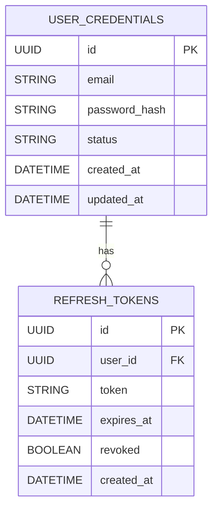

```mermaid
erDiagram
    USER_CREDENTIALS ||--o{ REFRESH_TOKENS : has

    USER_CREDENTIALS {
        UUID id PK
        STRING email
        STRING password_hash
        STRING status
        DATETIME created_at
        DATETIME updated_at
    }

    REFRESH_TOKENS {
        UUID id PK
        UUID user_id FK
        STRING token
        DATETIME expires_at
        BOOLEAN revoked
        DATETIME created_at
    }

```
