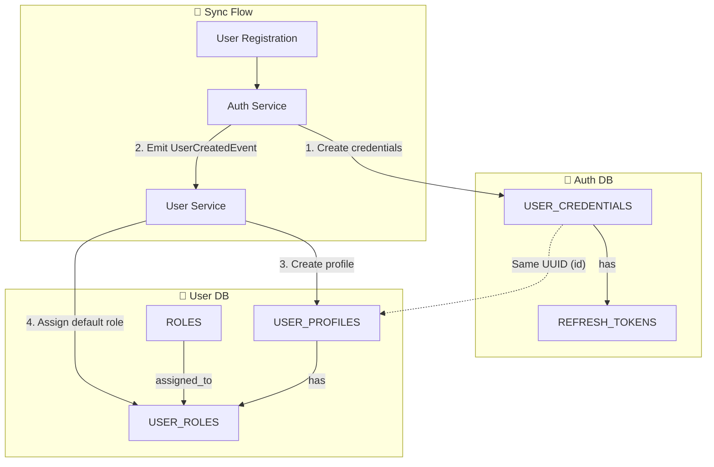

```mermaid
flowchart TB
    subgraph AuthDB["🔐 Auth DB"]
        UC[USER_CREDENTIALS]
        RT[REFRESH_TOKENS]
        UC -->|has| RT
    end

    subgraph UserDB["👤 User DB"]
        UP[USER_PROFILES]
        R[ROLES]
        UR[USER_ROLES]
        UP -->|has| UR
        R -->|assigned_to| UR
    end

    UC -.->|"Same UUID (id)"| UP

    subgraph SyncFlow["🔄 Sync Flow"]
        REG[User Registration]
        AUTH[Auth Service]
        USER[User Service]

        REG --> AUTH
        AUTH -->|"1. Create credentials"| UC
        AUTH -->|"2. Emit UserCreatedEvent"| USER
        USER -->|"3. Create profile"| UP
        USER -->|"4. Assign default role"| UR
    end

```
