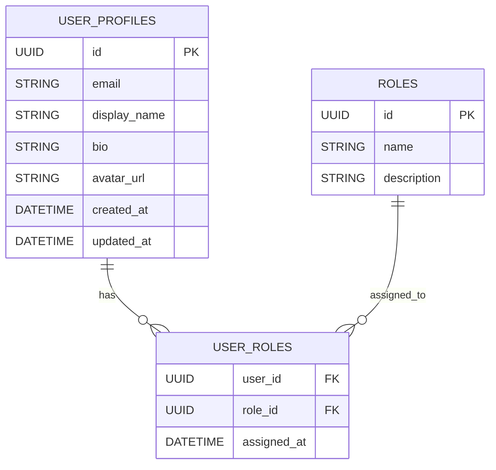

```mermaid
erDiagram
    USER_PROFILES ||--o{ USER_ROLES : has
    ROLES ||--o{ USER_ROLES : assigned_to

    USER_PROFILES {
        UUID id PK
        STRING email
        STRING display_name
        STRING bio
        STRING avatar_url
        DATETIME created_at
        DATETIME updated_at
    }

    ROLES {
        UUID id PK
        STRING name
        STRING description
    }

    USER_ROLES {
        UUID user_id FK
        UUID role_id FK
        DATETIME assigned_at
    }

```